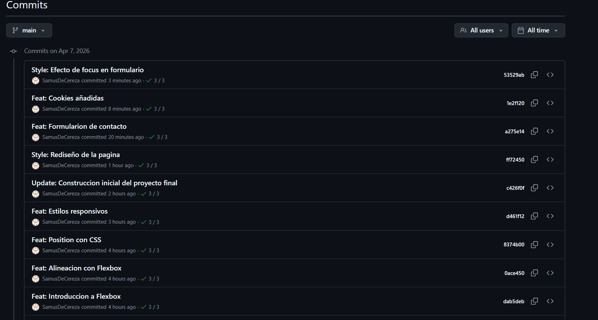
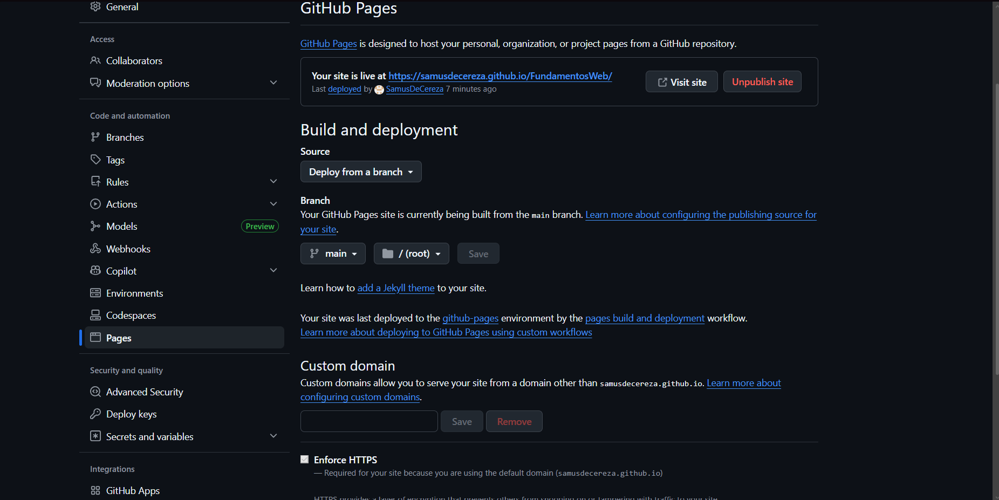

---

# ╔══════════════════════════════════════╗
# ║             Evidencias               ║
# ╚══════════════════════════════════════╝

---

Recopilacion de las evidencias requeridas para la entrega del proyecto: capturas de pantalla y enlaces.

---

## Ubicación de las evidencias

Todas las imágenes se encuentran dentro de la carpeta:

    ./evidencias

---

##  Historial de Commits

---

## Despliegue en GitHub Pages

--

## Link de la pagina desplegada en GitHub Pages

`https://samusdecereza.github.io/FundamentosWeb/`

---

## Link del repositorio en GitHub

`https://github.com/SamusDeCereza/FundamentosWeb`

# ╔══════════════════════════════════════╗
# ║            Aprendizajes              ║
# ╚══════════════════════════════════════╝

---

## ¿Qué fue lo más fácil y lo más retador?

### Lo más fácil

Escoger el tema

---

### Lo más retador

Hacer el menu de navegacion responsivo, y con un diseñ aceptable

---

## ¿Qué partes de HTML semántico y Flexbox usaste y por qué?

De HTML semantico utilice:
- nav
- main
- section
- footer

y de Flexbox use:
- flex-wrap
- justify-content
- align-content
- align-items
- gap

Y las utilice para dar forma a la pagina web, y hacer el diseño de escritorio y de movil

---

##  ¿Cómo organizaste tus media queries y breakpoints?

Los media queries los use justo despues del CSS de cada seccion, para asi tener juntos el CSS de la vista de escritorio y movil, a pesar de que la recomendacion es realizar la vista de movil primero, en este proyecto hice primero la vista de escritorio y luego la movil. 

En cuanto a los breakpoint, solamente use uno que me permitio realizar la vista movil y un aproximado a la vista de tablet.

---

## ¿Qué mejorarías en una siguiente versión?

El espaciado entre contenedores y las tecnicas que use para el diseño responsivo, creo que en algunos casos seria mejor usar Grid